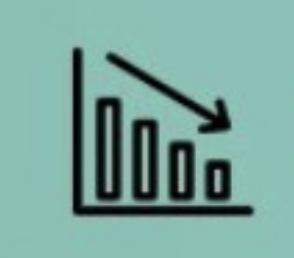

  

# GoCarbonTracker

GoCarbonTracker reads corporate climate reports and links every claim back to the page it came from, so a company can see what its own disclosures say, and where they appear to conflict, before a regulator or auditor does.

  <a href="https://gocarbontracker.net"><b>Project website</b></a> &nbsp;·&nbsp;
  <a href="https://hypergraph.gocarbontracker.net"><b>Open the hypergraph</b></a>

## What this repository contains

Public documentation and static interactive visualizations. It does **not** contain the extraction, retrieval, or analysis source code, and it is not a self-hostable release. The source code lives in a private development repository. See [Status](#status-as-of-2026-09-13) for what is public and what is not.

## See it live

| Where | What you will see |
|---|---|
| [gocarbontracker.net](https://gocarbontracker.net) | The project in one scroll: what it reads, what it produces, where to go next. |
| [Hypergraph intro](https://hypergraph.gocarbontracker.net) | Five chapters on how a claim becomes a node, how evidence attaches to it, and what an apparent conflict looks like before review. |
| [Automotive explorer](https://hypergraph.gocarbontracker.net/automotive) | The automotive supply chain by tier and country, with a Tata Motors company-intelligence panel. |
| [Supply chain maps](visualizations/README.md) | Static tier maps, tutorials, and OEM supplier networks served from this repository via GitHub Pages. Each page's README entry says whether its figures are extracted or illustrative. |

## One worked example: Tata Motors

Tata Motors is the company we have gone deepest on: annual and integrated reports, BRSR filings, CDP responses, CSR reports, policies, and investor presentations, all public documents.

**Citation tracing works.** Every Tata claim in the knowledge base resolves to a source document and a position in it. Three examples of the same target, as extracted:

| Extracted claim | Source document | Sentence in the document |
|---|---|---|
| "net zero emissions by 2040" | Tata Motors Integrated Annual Report 2023-24 | "…fulfilling our sustainability target of attaining net zero emissions by 2040." |
| "net zero emissions By 2045" | Tata Motors Integrated Annual Report 2023-24 | "…achieve net zero GHG emissions by 2045 in the CV business and by 2040 in the PV business." |
| "Net Zero by 2040" | Tata Motors CDP Climate Change response 2024 | "…achieving Net Zero by 2040 for PV and 2045 for CV Business." |

Our index places these at PDF pages 12, 25, and 92 respectively. Those page numbers are derived from a corpus-wide index and were not re-checked against the original PDFs on 2026-09-13; the document names and quoted sentences were.

**Contradiction detection did not.** An automated pass flagged 12 candidate conflicts in the Tata disclosures. Manual review on 2026-09-09 found **0 genuine contradictions**. The three claims above are one of them: the extractor split "2040 for PV and 2045 for CV" into two claims and then paired them against each other. The rest were table rows fragmented into separate claims, a GRI index table (page pointers) compared against an actual emissions disclosure, and one probable OCR misread.

That is the useful result. The system can trace a claim to its source. Telling a real inconsistency from an extraction artifact is the hard problem, and it is not solved. Nothing on the live sites or in this repository reports a contradiction as a finding; the automotive explorer shows Tata as "12 flagged, 0 confirmed after review".

## How it works

1. [Extraction pipeline](docs/architecture/extraction-pipeline.md): PDF reports become page-level contexts, text first, escalating to table-aware and vision extraction when text fails.
2. [HyperGraph knowledge base](docs/architecture/hypergraph-rag.md): contexts are indexed and connected so one relationship can hold a company, a topic, its evidence, and its supply-chain position at once.
3. [Zero-cost retrieval](docs/architecture/zero-cost-rag.md): local BM25 and TF-IDF indexing, no external embedding API.
4. [Discourse graph](docs/architecture/discourse-graph.md): claims are separated from evidence, linked, and scored; conflicts are surfaced as candidates.
5. Human review before anything is published. Candidates become findings only after someone reads the source pages.

The architecture documents were written in March 2026 and describe design intent. Each carries a note at the top saying which figures are dated snapshots.

## Evidence and review standard

- A detection is a candidate, not a finding.
- Every published example names the source document and quotes the sentence.
- Adjudication happens before publication, and the negative result is reported when that is what review produced.
- Visualization data that is illustrative rather than extracted is labelled as such in [visualizations/README.md](visualizations/README.md).
- Counts in this repository carry a date. A count without a date is an error; please open an issue.

## Status, as of 2026-09-13

| Component | State |
|---|---|
| Landing page, gocarbontracker.net | Live |
| Hypergraph intro and automotive explorer | Live |
| Tata Motors citation tracing | Verified end to end, 2026-09-09 |
| Tata Motors contradiction detection | 12 flagged, 0 genuine after manual review, 2026-09-09 |
| Dashboard, dashboard.gocarbontracker.net | Placeholder page, not a product |
| Extraction, retrieval, and analysis source code | Private, not published |
| Companies beyond Tata Motors | Automotive supply chain, lighter coverage; not adjudicated |
| Compliance mapping to CSRD and ESRS | Designed, not built |

## Get involved

Useful contributions right now, none of which need code access:

- **Source corrections.** If a quoted sentence or document name above is wrong, open an issue with the document and page.
- **Methods review.** Read the [discourse graph](docs/architecture/discourse-graph.md) design and tell us where the artifact classes above would slip through.
- **Case-study review.** Sustainability reporting practitioners who can read a Tata, BMW, or Mercedes-Benz disclosure and say whether an apparent conflict is real.
- **Visualization accessibility.** The static pages under [visualizations/](visualizations/) need keyboard and screen-reader review.

See [CONTRIBUTING.md](CONTRIBUTING.md). [Open an issue](https://github.com/GoCarbonTracker/go-carbon-tracker/issues) to start.

---

Built by [Varun Moka](https://github.com/varunmoka7).

Copyright 2025-2026 Varun Moka. The documentation and visualizations in this repository are published for review; no licence is granted yet for reuse or redistribution, and the application source code is not published.
