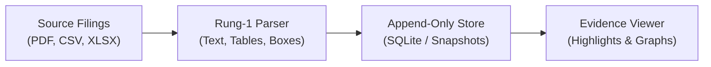

<p align="center">
  
</p>

<h1 align="center">GoCarbonTracker (gct)</h1>

<p align="center">
  <strong>An open-source workspace and evidence engine for corporate climate disclosures, tracing claims to document pages with an append-only audit trail.</strong>
</p>

<p align="center">
  <a href="LICENSE"></a>
  <a href="https://www.python.org/downloads/">= 3.11" /></a>
  
  
  
</p>

---


```mermaid
flowchart LR
    A["Source Filings<br/>(PDF, CSV, XLSX)"] --> B["Rung-1 Parser<br/>(Text, Tables, Boxes)"]
    B --> C["Append-Only Store<br/>(SQLite / Snapshots)"]
    C --> D["Evidence Viewer<br/>(Highlights & Graphs)"]
```

---

## Status

This is experimental software. Do not rely on it to keep private material out of what you share.

- The privacy acceptance of the sharing features (Epic 7) FAILED, and the release's final acceptance is INCOMPLETE.
- A sanitised output or a package is designed to leave private content out, but it is not verified to be free of it. These are the known ways a credential (such as an API key or a token) can still get through:
  - A credential in a PDF annotation, such as a note box, can appear in an evidence image and in the copy of the original that a package holds.
  - A credential in a PDF's metadata, such as its title, reaches the copy of the original in a package.
  - A package copies CSV and XLSX originals without checking them for credentials, so a credential in a cell ships.
  - A credential written in fullwidth characters is removed from every report format, but it ships in the database files inside a package.
- The leakage check that was run on exports made from real data left 15 images unread, so that check has not passed.
- None of these is fixed in this version. Read any sanitised output or package before you share it. [docs/privacy.md](docs/privacy.md) records the limits of the credential check under "What never leaves".

---

## Setup

Needs Python 3.11 or newer. [docs/setup.md](docs/setup.md) is the whole guide: Windows (not tested), an offline install, the first run and moving a workspace to another computer. The commands below are for macOS. `python3` must be 3.11 or newer (check with `python3 --version`). Python 3.13 on Apple Silicon macOS is the only combination that has been run; 3.11 and 3.12 are allowed by the package and have not been run.

User form (a copy of gct in its own environment, from the code folder):

```bash
python3 -m venv .venv
source .venv/bin/activate
pip install .
gct --version
```

Contributor form (linked to the code folder, with the tests):

```bash
python3 -m venv .venv
source .venv/bin/activate
pip install -e '.[dev]' 'setuptools>=77'
pytest
```

---

## Quick walkthrough

Once installed, you can create a local workspace, add documents, extract claims, and inspect evidence in your browser:

```bash
# 1. Initialize a new workspace
gct workspace init my-workspace

# 2. Add an organisation
gct company add "Acme Corp" --workspace my-workspace

# 3. Add reports (PDF, CSV, XLSX)
# Add reports (or use the included synthetic sample: examples/sample_sustainability_report.pdf)
gct doc add examples/sample_sustainability_report.pdf --company "Acme Corp" --workspace my-workspace

# 4. Read text and extract claims (zero-model baseline)
gct read --workspace my-workspace
gct extract --workspace my-workspace

# 5. Launch the local interactive evidence viewer
gct serve --workspace my-workspace
```

The viewer opens at `http://127.0.0.1:8765/?token=...`, letting you click any extracted figure to jump directly to its bounding box on the original report page.

---

## What works today

- `gct workspace init PATH` creates a workspace folder (SQLite database plus `files/`, `artifacts/`, `published/`, `exports/`, `logs/`).
- `gct company add NAME` and `gct company list`.
- `gct doc add SOURCE... --company NAME` registers PDF, XLSX and CSV files (recognised from content) for that one company. Each SOURCE is a file, a folder (its direct children of those types, by name) or a direct `http://` or `https://` link. The original is stored once by SHA-256. Adding the same bytes again is reported as a duplicate. Adding a changed file under the same name creates a new version and keeps the old one. A batch keeps going past a bad item, reports each one, and exits 4 if any was refused or failed. A link is downloaded once (only the address is sent); adding it again reuses that download. `--plan` shows what would happen to each item and stores nothing. A batch leaves one run record. Each document gets a privacy label and an availability; see "Privacy labels" below.
- `gct doc list` and `gct doc show ID`, each with the document's label and availability.
- Documents default to the `private` label (see [Status](#status)).
- `gct publish build` writes the next numbered, read-only data version (`published/vN.db`, companies and active documents) and makes it current. `gct publish restore` makes the previous version current again without rebuilding. `gct publish status` shows the current version and whether new history has arrived since. Only the current and previous files are kept; history is never touched.
- `gct publish build` and `gct publish restore` each leave a run record. `gct run list` shows the runs, newest first, with their outcome (`ok`, `failed`, or `interrupted` when the process stopped before finishing). `gct run show ID` shows one run: methods used, failures, retries, estimated and confirmed cost on separate lines, outputs, and every event.
- `gct workspace status` shows the schema version, the gct version, the number of companies and documents, the current published version, the number of runs and how the latest one ended.
- A workspace made by an older gct is upgraded automatically the first time a newer gct opens it, and the upgrade is recorded as a run. A workspace made by a newer gct is refused. See `docs/migrations.md`.
- `gct serve` starts a local service and opens it in your browser. It prints an address with a one-time session key (`http://127.0.0.1:8765/?token=...`); only that address lets a browser in, and the service listens on this computer only, with no setting to change that. `--port N` picks another port, `--no-open` skips the browser. It shows the evidence viewer for the current published version: pick a document, click a figure in the claim list to jump to its page with the figure boxed, or click a box to select its figure. Left and right arrows change the page, up and down move through the claims. Each figure shows its source-match label (`matched`, `cited` or `unresolved` with the reason, or `not checked: run gct link`). Each figure also shows its published period and boundary with their state (see Periods and boundaries); a version published by an older gct asks you to run `gct publish build` first. The panel also shows the claim's state, a correction with who made it, why and the value it replaced, anything that needs re-review, and a boundary header printed above the figure's column. The viewer can correct a current figure (see Corrections and re-reading). Under each figure, its Reviews section shows the company confirmations and auditor reviews of a version (the newest by default, earlier versions in a picker) in two columns, with a band when the two disagree, then its highlights and reviewer flags, and forms to add a company confirmation, an auditor review, a highlight, or to raise or withdraw a reviewer flag. Each company's Candidates entry lists its inconsistency candidates; one opens both pages with the two figures boxed and a form to adjudicate it (a restatement stays the `gct restate record` command, shown to copy). Every change runs the same check as its CLI command, waits for no other command (refused while one holds the workspace) and publishes a new version. A change is only accepted from the viewer page itself or with the session key sent as `Authorization: Bearer`.
- A stage contract and result cache exist for the processing stages, so an unchanged result is reused, only failed items are retried and a result from an older input or setting is never served. Downloading a link is the first stage that runs through it.
- `gct read [ID ...] [--company NAME]` reads every page of PDF documents with pdfplumber: text, words with their positions, and ruled tables. Without IDs it reads every active document. Each reading is a JSON file under `artifacts/`, stored once by SHA-256. A page already read with the same file and the same reader settings is never read again; a changed setting reads it again. Each page gets three checks: no text (a scanned picture), fragmented text, and tables that are mostly empty cells. Flagged pages are counted and the number of pages without text is always printed. Nothing is sent anywhere and no model is used. A damaged PDF or a page that fails is reported, the rest is read, and the command exits 4; running it again reads only what is missing.
- `gct doc pages ID` shows, per page, how it was read: rung, method, words, tables and quality flags.
- Paid model work and sending private content to an outside service each need their own approval, and both are off by default. `gct approve spend AMOUNT` sets the workspace's estimated spending limit in USD (0 means no paid work); each paid run will also need its own allowance, which must fit under the limit minus the estimated spend so far. The limit is estimated from the configured prices and the usage the provider reports, not taken from a provider bill. `gct approve transfer NAME` lets one external model service receive private documents, `--revoke` withdraws it. The approval holds only for the address and model the adapter had when it was given; change either in the file and it must be given again. `gct approve list` shows the limit, the estimated spend so far and the approval of each adapter. A call that would pass the allowance or the cap, or send a private document without a transfer approval, is refused and never sent. Spend counts the cost the provider reported when it reports one, and otherwise gct's own figure: the token counts the provider returned times the configured prices, or the estimate made before the call. Calls that failed after they were sent count too. Only a cost the provider returned is shown as confirmed.
- Model adapters are described in a file of their own, `~/.config/gct/models.toml` (or the path in `GCT_MODELS`), never in the workspace. Each `[adapters.NAME]` table gives `provider = "openai_chat"` (the chat completions interface of Ollama, NVIDIA, OpenRouter and OpenAI), `base_url`, `model`, `external`, `paid`, and optionally `api_key_env` (the name of the environment variable holding the key, never the key itself), `price_in` and `price_out` (USD per million tokens) and `timeout`. An adapter marked `external = false` must point at this computer. Prices and the timeout must be numbers of 0 or more. A model service that answers with a redirect gets a failure; gct never follows it. `gct model list` shows the adapters and whether each key variable is set. Keys and anything that looks like one are replaced by `[redacted]` in error logs, the run log, failure messages and text sent to a model. Without the file nothing changes: rung 1 reading needs no model. Configured is not enabled: no reading step uses a configured model in this version, so an adapter changes nothing about `gct read` or `gct extract` (see [docs/models.md](docs/models.md)).
- `--json` on every command. Key names are in `docs/cli-json.md`.
- Every table except `schema_version` rejects updates and deletes.
- Only one command that changes a workspace runs at a time: a second one is refused (exit 4) until the first finishes. Commands that only look (`list`, `show`, `status`, `doc pages`, `run list`, `run show`, `serve`) are not held up (apart from a one-time workspace upgrade), so you can watch a long run. The lock is the operating system's, on `workspace.lock`; it goes away with the process, also after a crash.
- A failed command prints one cause and one next step, also for a mistyped option (exit codes and the run log in `docs/troubleshooting.md`). `gct --version` prints the version. `gct troubleshoot export` writes `exports/troubleshooting-<time>/` with the versions, counts and run history a maintainer needs to help, and no document, company or contributor name, path or key; read it before you send it.

---

## Resume and retry

Every `gct read`, `gct extract`, `gct link`, `gct infer`, `gct match` and `gct doc add` run records exactly what it was given. `gct run resume ID` runs that again in a new run, for a run that was interrupted or failed: what was already done is reused from cache (pages already read, files already registered show as duplicates), so only the rest is processed. `gct run retry ID` processes again only what failed in that run and has not succeeded since: the pages that failed (to read or to extract), the locations that could not be checked, the documents that could not be inferred, a PDF that could not be opened (read again in full), or the files and links that could not be added. A document that is no longer active is reported as skipped. With nothing failed it says so and exits 0. The run that was resumed or retried is left as it was; the new run notes which one it continues. A finished run cannot be resumed (retry it instead), and only `read`, `extract`, `link`, `infer`, `match` and `doc add` runs can be resumed or retried.

---

## Claims

Claims from `gct extract` come from fixed reading rules (a no-model baseline). Their accuracy was measured once, against a private gold set of 170 figures from the reports of two real companies (scorer version 1, gold commit 3985743). The gold set has three groups; the result was 0 of 80 Found in the text group, 0 of 50 in the table group and 0 of 40 in the figure group. Found means value, unit, metric, entity, boundary and period all match the gold row. The release plan's accuracy gate (G2) sets a target of 90% Found in each group, so the no-model baseline fails it. The gold set is private and is not in this repository.

- `gct extract [ID ...] [--company NAME]` lists the figures on every read page: numbers in ruled tables, and numbers followed by a unit (`tCO2e`, `MWh`, `%` and a few more) in the text. Each claim keeps the metric wording, the value, the unit and the period label exactly as printed, plus the page and the box it came from. A value is filled only for a plain Western number (`1,234.5`); other forms such as `1,23,456` or `(12)` keep only the printed text. Years and numbers in the top or bottom 5% of the page are not claims. Units are recognised, never converted; the extracted boundary is `unknown` (see Periods and boundaries). A table figure's box comes from the cell pdfplumber found; when the cell's words do not match the figure, the claim gets no box (its source match is `cited`, reason `no box`), never a guessed one. A page whose reading has not changed is not extracted again; a new reading adds a new version of each claim and keeps the old one. Documents not read yet are skipped with a note.
- `gct claims list --doc ID` shows one line per claim: claim id, page, value as printed, unit, metric wording, the period (the label as printed until `gct infer` runs, then the dates with a state word, or the label and `unknown` with the reason), the boundary in the same way, the source match status with its reason, and the box when there is one.
- `gct publish build` includes the newest version of each claim of active documents, with its source location and source match status.

---

## Packages

A package is a copy of the workspace for someone else to reopen, add reports to and process again. gct writes it fresh into `exports/package-v<N>-<stamp>-<mode>/`, with its own data version 1.

- `gct package preview [--complete] [--include identity,contributor_text,flags]` shows what would go in and what is left out, and prints a token. It writes nothing.
- `gct package create --confirm TOKEN [--include ...]` writes a package that is designed to leave private content out (see [Status](#status)): only rows of shareable documents, contributors shown as "Contributor 1", "Contributor 2" and so on, their text withheld, no run log lines, approvals or saved views. Each `--include` class keeps its own part.
- `gct package create --complete --include-private --confirm TOKEN` writes everything except approvals, private documents included; the source run log records that you authorised it.

Both refuse a data version that is out of date (build a fresh one with `gct publish build`) and a token from another preview. A copy of the workspace folder is a complete copy of everything in it. Details are in `docs/packages.md`.

---

## Highlights

`gct highlight add CLAIM --version V --note TEXT --as KEY --capacity TEXT` marks a claim's newest version with a short note; `gct highlight list CLAIM` lists them per version. A highlight is its own record: it is not a correction, a company confirmation or a review outcome, and nothing counts it as one. Details are under "Highlights" in `docs/reviews.md`.

---

## Tables and Graphs

`gct view records [--filter JSON|@FILE] [--shape table|graph|series|values] [--offset N] [--limit N] [--sort KEY[:desc]] [--claims ID,ID]` lists the claims of the current published version that one filter selects (company, document, metric, wording, period, boundary, state, evidence, matching, series, comparison, review), as table rows, a graph or one metric's series. Every row, node and edge says where its evidence opens. The viewer's Tables and Graphs section uses the same filter on one pinned version: it counts the claims that match, and offers a newer version with a Reload button when one is published. The table and the graphs themselves are not in the viewer yet. Details are in `docs/views.md`.

---

## Report preview

`gct report preview [--filter JSON|@FILE] [--complete] [--include identity,contributor_text,flags] [--data-version V]` shows what a report of the current published version would hold: the version it reads, the rows per report and, for a sanitised output (the default), what it leaves out and why. A sanitised output is designed to leave out every row that names a private document, archived and deleted documents, reviewer flags, contributor text and contributor names (each contributor becomes "Contributor N"), within the limits under [Status](#status); `--include` keeps the named classes. Values such as the review summary are worked out again from the rows that stay, so they read as if the left-out rows did not exist. `--complete` keeps every row, each with its label. When every document in the selection is private, the preview names them and gives the `gct doc label` command. The preview writes nothing, and it refuses a workspace that needs an upgrade until a writing command such as `gct publish build` has upgraded it. Details are in `docs/privacy.md`.

---

## Exporting report data

`gct report all --format json` writes the report data of the current published version into a new folder, `exports/all-v<N>-<stamp>-sanitised/`: `dataset.json`, which holds the evidence index, the restatement log and the gap report with the data version it came from, and `dataset-1.schema.json`, the JSON Schema the file follows, so anyone can check the file without GCT. `evidence-index`, `restatement-log` and `gap-report` work the same way; a JSON export holds the whole dataset whichever you name. The options are those of `gct report preview`: the export is sanitised unless you add `--complete`, and a complete folder ends in `-complete`. The command prints the preview after the files, on your terminal only. It never overwrites an export, and a refused export writes nothing. When the workspace has changed since the version was built, it still exports that version and tells you to run `gct publish build` first if you want the changes. Copies you have exported or shared cannot be recalled by GCT, also after `gct doc delete`. Details are in `docs/reports.md`.

- `--format pdf` writes one PDF per report, for a reader who does not run GCT: the rows, then an evidence appendix that shows each cited figure as a picture of its place on the source page, cut from the stored original with the viewer's renderer and outlined; a sanitised PDF is designed to hold no private text or page image (see [Status](#status)).
- `--format page` writes one HTML page per report with the same rows and pictures, which opens from the export folder in a browser and runs no script and loads nothing from the network.

---

## What does not exist yet

OCR for scanned pages, model-based rungs (no rung above 1 exists yet, so nothing calls a model and no command takes an allowance yet), chart reading, standard metric names, review in the viewer of page acceptance, gap confirmation, infer review and restatement (those stay CLI commands). `docs/setup.md` says what the no-model install reads and does not read.

---

## License

This project is licensed under the [MIT License](LICENSE).
See [ORIGINS.md](ORIGINS.md) for provenance, patents, and copyright notices.
